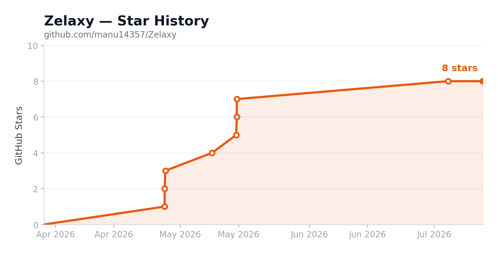

<p align="center">
  
</p>
<h1 align="center">Zelaxy</h1>
<p align="center">
  <b>The open-source visual platform for building, running & shipping AI agents and workflows.</b><br/>
  <sub>Drag blocks onto a canvas → wire agents, tools & logic → run with live streaming. No code required — fully extensible when you need it.</sub>
</p>

<p align="center">
  
</p>

<p align="center">
  <a href="https://zelaxy.in"><b>Website</b></a> ·
  <a href="https://docs.zelaxy.in"><b>Docs</b></a> ·
  <a href="#-quickstart"><b>Quickstart</b></a> ·
  <a href="#-why-zelaxy"><b>Why Zelaxy</b></a> ·
  <a href="https://github.com/manu14357/Zelaxy/issues"><b>Issues</b></a> ·
  <a href="#-contributing"><b>Contributing</b></a>
</p>

<p align="center">
  <a href="https://github.com/manu14357/Zelaxy/actions/workflows/ci.yml"></a>
  <a href="https://github.com/manu14357/Zelaxy/blob/main/LICENSE"></a>
  <a href="https://github.com/manu14357/Zelaxy/stargazers"></a>
  <a href="https://github.com/manu14357/Zelaxy/commits/main"></a>
  <a href="https://github.com/manu14357/Zelaxy/pulls"></a>
</p>

<p align="center">
  
  
  
  
  
</p>

<p align="center">
  <b>⭐ If Zelaxy is useful to you, star the repo — it genuinely helps the project reach more builders.</b>
</p>

---

## What is Zelaxy?

**Zelaxy** is a visual operating system for AI work. You compose workflows on a canvas out of
**blocks** — AI agents, integrations, logic, loops, sub-workflows — connect them, and a real
execution engine runs the graph with **token-by-token LLM streaming**.

It looks like a flow builder. Under the hood it's a **topological execution engine** with parallel
branches, loops, conditional routing, sub-workflows, built-in vector search (RAG), and
multi-provider AI orchestration — the kind of thing you'd otherwise stitch together from a dozen
scripts and services.

<div align="center">

| 🧩 **264** blocks | 🔌 **240+** integrations | 🤖 **21** AI providers | ⚡ **30+** triggers | 🧠 **RAG** built-in |
|:---:|:---:|:---:|:---:|:---:|

</div>

> **Build workflows, not glue code.** Drag three blocks onto the canvas, connect them, hit run.

---

## Table of Contents

- [Why Zelaxy](#-why-zelaxy)
- [Features](#-features)
- [How it works](#-how-it-works)
- [Blocks & integrations](#-blocks--integrations)
- [Quickstart](#-quickstart)
- [Configuration](#-configuration)
- [Development](#-development)
- [Deployment](#-deployment)
- [Tech stack](#-tech-stack)
- [Project structure](#-project-structure)
- [Contributing](#-contributing)
- [Sponsors](#-sponsors)
- [License](#-license)

---

## ✨ Why Zelaxy

Most automation tools make you choose: **great integrations _or_ real AI _or_ open-source & self-host.**
Zelaxy is built to give you all three on one canvas.

|  | **Zelaxy** | n8n | Zapier | Flowise / Langflow |
|---|:---:|:---:|:---:|:---:|
| Open source & self-hostable | ✅ MIT | ⚠️ fair-code | ❌ SaaS only | ✅ |
| Visual canvas builder | ✅ | ✅ | ⚠️ linear | ✅ |
| AI-native (multi-provider LLMs) | ✅ **21 providers** | ⚠️ add-on | ⚠️ limited | ✅ |
| Built-in RAG / vector search | ✅ pgvector | ⚠️ via nodes | ❌ | ✅ |
| Real-time multi-user collaboration | ✅ | ❌ | ❌ | ❌ |
| Live token streaming while running | ✅ | ❌ | ❌ | ⚠️ |
| Guardrails (PII, hallucination, schema) | ✅ | ❌ | ❌ | ⚠️ |
| Code when you need it (JS / HTTP / MCP) | ✅ | ✅ | ⚠️ | ⚠️ |
| SDKs (TypeScript + Python) & CLI | ✅ | ⚠️ | ❌ | ⚠️ |

**Zelaxy is right for you if you want to:**

- ⚡ Automate complex AI processes **without writing a custom backend**
- 🔀 Chain **multiple LLM providers** (OpenAI, Claude, Gemini, Groq, DeepSeek, Grok, Mistral, Ollama…) in one pipeline
- 🔍 **Visually debug** — see exactly which block produced which output, and how long it took
- 📚 Build **RAG pipelines** with vector search built in — upload, embed, and query from any block
- 🪝 Trigger from **Slack, GitHub, Gmail, Stripe, Telegram**, webhooks, or cron
- 🏠 **Self-host** an open-source platform you can extend with your own blocks and tools

---

## 🚀 Features

| 🧩 **264 blocks** | 🔌 **240+ integrations** | ⚡ **Live streaming** |
|---|---|---|
| Agents, logic, routing, loops, parallel, sub-workflows, functions, guardrails & more. | Slack, Gmail, Jira, Notion, S3, Pinecone, Snowflake, Firecrawl, ElevenLabs… **880+ actions**. | Token-by-token LLM streaming. Watch the AI think in real time. |
| 🤖 **21 AI providers** | 🧠 **Knowledge base (RAG)** | 🪝 **30+ triggers** |
| OpenAI, Claude, Gemini, Groq, DeepSeek, Grok, Cerebras, Mistral, NVIDIA, Bedrock, OpenRouter, Ollama, vLLM, LM Studio… | Vector search via pgvector. Upload docs, embed, and query from any block. | Webhooks, cron, Slack, GitHub, Gmail, Stripe, Telegram, Teams, Outlook, WhatsApp & more. |
| 🛡️ **Guardrails** | 🤝 **AI copilot + Wand** | 🔄 **Real execution engine** |
| PII detection, hallucination checks, JSON-schema validation. Safety built in. | RAG-powered assistant that generates code, schemas & prompts. Natural-language "Wand" edits. | Topological sort, parallel branches, `forEach`/`while` loops, conditional routing, sub-workflows. |
| 👥 **Real-time collaboration** | 🔐 **Self-hosted & secure** | 🧰 **SDKs + CLI** |
| Multi-user live editing over WebSockets, with live permission checks. | Bring your own keys, your own database, your own infra. MIT licensed. | TypeScript SDK, Python SDK, and a CLI for programmatic workflows. |

---

## 🛠 How it works

|  |  |  |
|---|---|---|
| **01 · Design** | Drag blocks onto the canvas. Connect AI agents, APIs, databases, and services. | 🎨 |
| **02 · Trigger** | Webhooks, cron schedules, or event-driven from Slack, GitHub, Gmail, Stripe & more. | 🪝 |
| **03 · Run & stream** | Hit run. Watch blocks execute in order with real-time token streaming and per-block I/O. | ⚡ |

---

## 🧩 Blocks & integrations

<details>
<summary><b>Browse the block categories</b> (264 blocks across these families)</summary>

| Category | Examples |
|----------|----------|
| **AI Agents** | OpenAI, Claude, Gemini, Groq, DeepSeek, Grok, Cerebras, HuggingFace, Perplexity, Mistral, Thinking, Vision |
| **Core Logic** | Condition, Router, Switch, Evaluator, Function, API, Loop, Parallel, Wait, Response, Human-in-the-loop |
| **Messaging** | Slack, Discord, Telegram, WhatsApp, Gmail, Outlook, Microsoft Teams, SMTP |
| **Productivity** | Jira, Linear, Notion, Google Docs, Google Calendar, Google Sheets, Excel, Planner, Confluence, Airtable, Asana |
| **Data & Search** | Pinecone, Qdrant, Supabase, Wikipedia, ArXiv, Reddit, Serper, Tavily, Exa, Linkup |
| **Storage** | S3, Google Drive, OneDrive, SharePoint, Dropbox, Box |
| **Databases** | Snowflake, MSSQL, Postgres, Google Sheets, Excel |
| **Web & Browser** | Firecrawl, Jina, Stagehand (browser automation), HTTP |
| **Voice & Media** | ElevenLabs, Twilio SMS, Translate, Image Generator, YouTube, Vision |
| **Knowledge & Memory** | Knowledge base (RAG), Memory (key-value), Mem0 |
| **Safety** | Guardrails — PII detection, hallucination checks, JSON-schema validation |
| **Custom** | MCP servers, Function (JavaScript), API (HTTP), Webhooks, Workflow (sub-flows) |

</details>

Full, searchable reference at **[docs.zelaxy.in](https://docs.zelaxy.in)**.

---

## ⚡ Quickstart

Open source. Self-hosted. No account required.

```bash
git clone https://github.com/manu14357/Zelaxy.git
cd Zelaxy
bun install
cp apps/zelaxy/.env.example apps/zelaxy/.env.local
# Edit .env.local — set DATABASE_URL, auth secrets, and at least one LLM API key
cd apps/zelaxy && bunx drizzle-kit migrate && cd ../..
bun run dev:full
```

App runs at **http://localhost:3000**, docs at **http://localhost:3001**.

Prefer hosted? Try **[zelaxy.in](https://zelaxy.in)** · Docs: **[docs.zelaxy.in](https://docs.zelaxy.in)**

> **Requirements:** [Bun](https://bun.sh) ≥ 1.2 · [PostgreSQL 17](https://www.postgresql.org/) with [pgvector](https://github.com/pgvector/pgvector) · at least one LLM API key.

---

## 🔧 Configuration

| Variable | Description |
|----------|-------------|
| `DATABASE_URL` | PostgreSQL connection string |
| `REDIS_URL` | Redis connection string (e.g. `rediss://…` from Upstash) |
| `BETTER_AUTH_URL` | App URL (e.g. `http://localhost:3000`) |
| `BETTER_AUTH_SECRET` | Auth secret (min 32 chars) |
| `ENCRYPTION_KEY` | 64-char hex string for AES-256 |
| `INTERNAL_API_SECRET` | Internal API secret (min 32 chars) |
| `NEXT_PUBLIC_APP_URL` | Public app URL |

**LLM providers** (add any): `OPENAI_API_KEY`, `ANTHROPIC_API_KEY`, `GOOGLE_API_KEY`, `GROQ_API_KEY`, `DEEPSEEK_API_KEY`, `XAI_API_KEY`, `CEREBRAS_API_KEY`, `NVIDIA_API_KEY`, `MISTRAL_API_KEY`, `OPENROUTER_API_KEY`

**Local models:** `OLLAMA_URL` (default `http://localhost:11434`), `LM_STUDIO_URL` (default `http://localhost:1234`)

---

## 💻 Development

```bash
bun run dev:full          # Full dev (app + websocket + docs)
bun run dev               # App only
bun run dev:sockets       # WebSocket server only
bun run build             # Build all
bun run test              # Run tests (~900 unit tests)
bun run lint              # Lint and auto-fix (Biome)
bun run type-check        # Type check (0 errors)
```

```bash
cd apps/zelaxy && bunx drizzle-kit studio    # Database GUI
cd apps/zelaxy && bunx drizzle-kit migrate   # Run migrations
bun run start:worker                          # Background job worker (requires REDIS_URL)
```

---

## 🌐 Deployment

The Next.js app deploys to **Vercel**. Two long-running services run on **Railway**:

| Service | Config file | Start command |
|---------|-------------|---------------|
| Socket server | `railway.json` | `bun run start:sockets` |
| Background worker | `railway-worker.json` | `bun run start:worker` |

Set `NEXT_PUBLIC_SOCKET_URL` and `SOCKET_SERVER_URL` on Vercel to your Railway socket URL. Background
jobs use **BullMQ** backed by **Redis** (Upstash recommended) — set `REDIS_URL` on both Vercel and the
Railway worker.

---

## 🧰 Tech stack

| Layer | Technology |
|-------|-----------|
| **Framework** | Next.js 15 (App Router, Turbopack) · React 19 |
| **Language** | TypeScript |
| **Runtime** | Bun |
| **Database** | PostgreSQL 17 + pgvector (Drizzle ORM) |
| **Auth** | better-auth (OAuth 2.0) |
| **UI** | Tailwind CSS + shadcn/ui (Radix) · @xyflow/react |
| **State** | Zustand · TanStack Query |
| **Real-time** | Socket.IO |
| **Background jobs** | BullMQ + ioredis (Redis) |
| **Monorepo** | Turborepo + Bun workspaces |
| **Testing** | Vitest |
| **Linter / formatter** | Biome |
| **Docs** | Fumadocs (MDX) |

---

## 📁 Project structure

```
Zelaxy/
├── apps/
│   ├── zelaxy/           # Main Next.js 15 application (the product)
│   │   ├── app/          # App Router — pages (/arena/**), API routes (/api/**)
│   │   ├── blocks/       # 264 block definitions + registry
│   │   ├── tools/        # 240+ integrations (880+ actions) + registry
│   │   ├── executor/     # Workflow execution engine (dag, resolver, handlers)
│   │   ├── providers/    # 21 LLM providers
│   │   ├── triggers/     # Webhook / schedule / event triggers
│   │   ├── serializer/   # Editor graph → executable workflow
│   │   ├── db/           # Drizzle ORM schema + queries
│   │   ├── stores/       # Zustand state
│   │   ├── socket-server/# Socket.IO realtime collaboration server
│   │   └── worker/       # Background jobs
│   ├── docs/             # Documentation site (Fumadocs)
│   └── core/             # Shared core
├── packages/             # CLI · TypeScript SDK · Python SDK
├── LICENSE               # MIT
└── package.json          # Monorepo root
```

Working in the codebase? Start with [CLAUDE.md](CLAUDE.md) and [CONTRIBUTING.md](CONTRIBUTING.md).

---

## 🤝 Contributing

Contributions are welcome — blocks, integrations, bug fixes, docs, all of it.

1. Fork the repository
2. Create a feature branch (`git checkout -b feat/your-feature`)
3. Make your changes
4. Run `bun run test`, `bun run lint`, and `bun run type-check`
5. Open a pull request

New here? Look for [`good first issue`](https://github.com/manu14357/Zelaxy/issues?q=is%3Aissue+is%3Aopen+label%3A%22good+first+issue%22) and read [CONTRIBUTING.md](CONTRIBUTING.md).

---

## 💖 Sponsors

Zelaxy is free and open source. Sponsors keep it that way.

<p align="center">
  <a href="https://github.com/sponsors/manu14357"></a>
</p>

| Tier | $/mo | Perks |
|------|------|-------|
| 💎 **Diamond** | $1,000 | Co-branding + monthly 1:1 + all below |
| 🏆 **Platinum** | $500 | Custom block icon in arena + all below |
| 🥇 **Gold** | $250 | Large logo everywhere + priority support |
| 🥈 **Silver** | $100 | Logo on README, website, docs + early access |
| 🥉 **Bronze** | $50 | Logo on README, website, and docs |
| 🙌 **Supporter** | $15 | Name + link on README, website, and docs |
| 💜 **Backer** | $5 | Name on README + website |

<!-- SPONSORS:START -->
<p align="center">
  <em>Your logo here — <a href="https://github.com/sponsors/manu14357">become a sponsor</a></em>
</p>
<!-- SPONSORS:END -->

---

## 📄 License

MIT © 2025 Zelaxy — see [LICENSE](LICENSE).

---

<p align="center">
  <b>⭐ Star Zelaxy to follow along</b> — new blocks, integrations, and features ship constantly.
</p>

<p align="center">
  <a href="https://star-history.com/#manu14357/Zelaxy&Date">
    
  </a>
</p>

<p align="center">
  <sub>Built for people who want to automate with AI — not write glue code.</sub>
</p>
